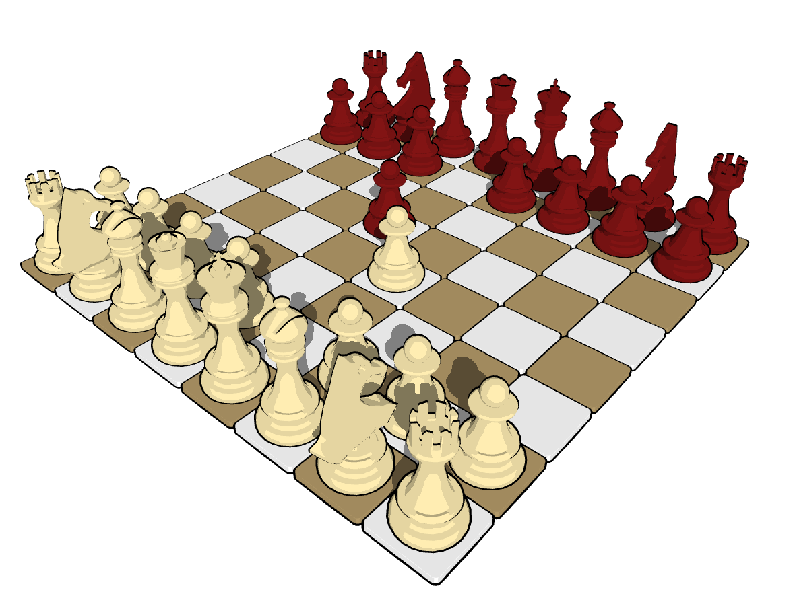

<p align="center"></p>
<p align="center"> 3D Chess game based on OpenGL and Stockfish </p>

## Installation

- Install sfml and cmake
```bash
sudo apt-get install libsfml-dev cmake
```

- Compile ToonChess
```bash
mkdir build && cd build && cmake ..
make
```

- Run it!
```bash
./ToonChess
```
