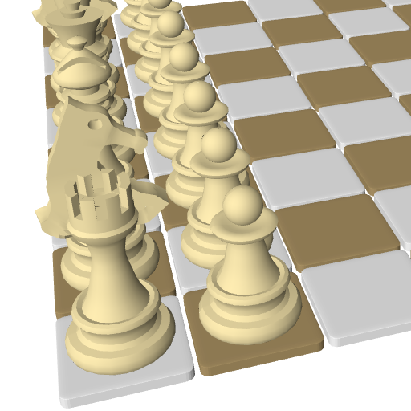

<p align="center"></p>
<h1 align="center"> 3D Chess game based on OpenGL and Stockfish </h1>

[](https://travis-ci.org/martinRenou/ToonChess)

## Installation (Only linux compatible)

Install [CMake](https://cmake.org/), [SFML](https://www.sfml-dev.org/index.php) and [Stockfish](https://stockfishchess.org/):
```bash
sudo apt-get install cmake libsfml-dev stockfish
```

Download source code:
```bash
git clone https://github.com/martinRenou/ToonChess.git
cd ToonChess
```

Compile ToonChess:
```bash
mkdir build && cd build && cmake ..
make
```

Run it!
```bash
./ToonChess
```

Tests are written using [GoogleTest](https://github.com/google/googletest), you can run them after installation with:
```bash
./tests
```

## Why ?
There is already plenty of open-source chess games, so why would I develop my own one?
I wanted to improve my knowledge of OpenGL and c++ programming. I am not even a chess gamer, I am just interested in real time 3D rendering. I also wanted to learn some tools like GoogleTest and Cppcheck. And here is the result, feel free to copy parts of the code for your own OpenGL projects.

## How ?
### Toon Style
I wanted a toon effect for my game, this effect can be performed using cel-shading technique. Instead of using "normal" enlightening, lights are computed using a threshold: if light intensity is more important than this threshold the mesh will be bright, dark otherwise. In fact in ToonChess shaders I used three thresholds, that is to say four levels of enlightening.

<p align="center"></p>

I also wanted to display black borders for chess pieces. In order to explain how I did it I'll have to explain what is Backface Culling. Backface Culling is a step in the rendering in which hidden triangle faces of the mesh (not visible from the camera point of view) are sorted and not rendered in order to save computation time. Now, in order to display black borders I chose to display those "hidden triangle faces" in black and to enlarge them. It results in a nice black border effect, without the need of a filtering step (I could have used a sobel filter for example).

<p align="center"></p>

### Shadow Mapping
For the shadows I used the well-known Shadow Mapping technique. A separate render is performed using a Render To Texture technique, texture in which the distance from the light is saved for each mesh (See next picture, the nearest from the light the mesh is, the darkest it is in the shadowmap). And this distance from the light can be used in the main rendering process in order to know if the currently rendered part of the mesh is hidden from the light by an other object. See [this](http://www.opengl-tutorial.org/intermediate-tutorials/tutorial-16-shadow-mapping/) tutorial if you want to learn more about it. I then used the Percentage Close Filtering technique in order to make the shadows smoother (See this [nvidia article](http://developer.download.nvidia.com/books/HTML/gpugems/gpugems_ch11.html) about PCF).

<p align="center"></p>

### Color Picking
Concerning mesh picking, I used a Color Picking technique. When a click event occurs, an other render is performed using a RTT technique, in which meshes are colored according to their positions on the grid (See next picture). The color on the clicked position of the screen is then extracted in order to know which piece on the grid has been selected. This technique is never used in video games, but it perfectly fits my needs for this project. Performance are ok because the RTT is performed only when a click event occurs.

<p align="center"></p>

### IA
Developing the IA would have been to much work, and it wasn't the purpose of this project. I chose to use Stockfish for that. Stockfish runs in a subprocess, and communicates with the GUI using the UCI protocol.

### Meshes
I created meshes on [Blender](https://www.blender.org/) and exported them under ".obj" file format.
