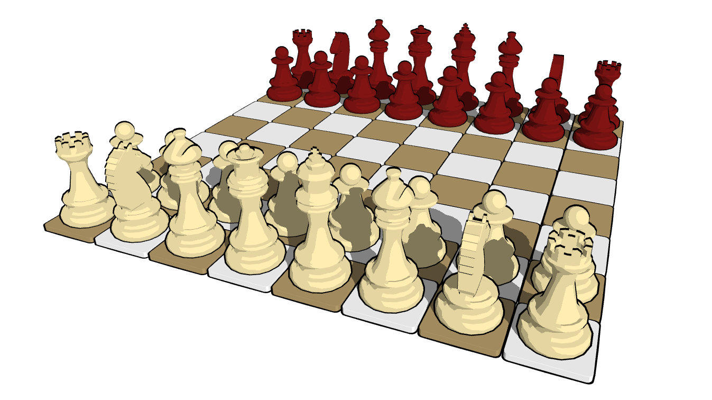

<p align="center"></p>
<h1 align="center"> 3D Chess game based on OpenGL and Stockfish </h1>

[](https://travis-ci.org/martinRenou/ToonChess)

## Installation (Only linux compatible)

Install [CMake](https://cmake.org/), [SFML](https://www.sfml-dev.org/index.php) and [Stockfish](https://stockfishchess.org/):
```bash
sudo apt-get install cmake libsfml-dev stockfish
```

Download source code:
```bash
git clone https://github.com/martinRenou/ToonChess.git
cd ToonChess
```

Compile ToonChess:
```bash
mkdir build && cd build && cmake ..
make
```

Run it!
```bash
./ToonChess
```

## Tests

Tests are written using [GoogleTest](https://github.com/google/googletest), you can run them after installation with:
```bash
./tests
```

### ToonChess
## Why ?
There is already plenty of open-source chess games, so why would I develop my own one?
I wanted to improve my knowledge of OpenGL and c++ programming. I am not even a chess gamer, I am just interested in 3D real time rendering. I also wanted to learn some tools like GoogleTest and CPPCHECK. And here is the result, it would have been a shame not to share my work.

## How ?
For the shadows I used the well-known shadow-mapping technique. A separate rendering is performed using a Render To Texture technique, texture in which the distance from the light is saved for each mesh (See next picture). And this distance from the light can be used in the main rendering process in order to know if the currently rendered part of the mesh is hidden from the light by an other object. See [this](http://www.opengl-tutorial.org/intermediate-tutorials/tutorial-16-shadow-mapping/) tutorial if you want to learn more about it.

<p align="center"></p>

Concerning mesh picking, I used a color-picking technique. When a click event occurs, an other rendering is performed using a RTT technique, in which meshes are colored according to there positions on the grid (See next picture). The color on the clicked position of the screen is then extracted in order to know which piece on the grid has been selected.

<p align="center"></p>

Meshes have been created on [Blender](https://www.blender.org/) and exported under ".obj" file format.
